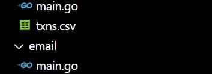
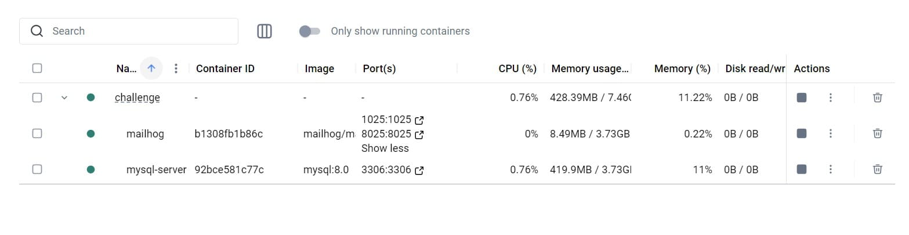

# STORI ACCOUNT

## Tags and Features 0.0.1

This version is primarily based on ensuring that each service works correctly and independently, with each running locally.

## Description

Your project must meet these requirements:

1. The summary email contains information on the total balance in the account, the number of
transactions grouped by month, and the average credit and average debit amounts grouped by
month. Using the transactions in the image above as an example, the summary info would be
Total balance is 39.74
Number of transactions in July: 2
Number of transactions in August: 2

Average debit amount: -15.38
Average credit amount: 35.25

2. Include the file you create in CSV format.
3. Code is versioned in a git repository. The README.md file should describe the code interface and
instructions on how to execute the code.

## Configuration

The configuration is as follows:

1. Create an S3 bucket in AWS and upload the file to be read, which are the logo and create a file with the name txns.cv in csv folder




2. Run the Docker Compose project using the following command, and make sure to rename the .env_example file to .env. Then, in line 11 of the mysql/database/database.go file, update the access credentials as needed.

**USER**:**PASSWORD**@tcp(**URL**:**PORT**)/**DATABASE**?charset=utf8mb4&parseTime=True&loc=Local

with 

test:test@tcp(localhost:3306)/stori?charset=utf8mb4&parseTime=True&loc=Local

```
docker-compose up -d 
```

From there, you'll be able to connect to the database using the credentials in the .env file, and also check the emails if any are sent.



3. Configure the email settings on line 13, where you'll find the username and password to be changed as needed. Also, on line 34, you’ll find the configuration for the sender, recipient, and subject.

4. To test the code, you need to go into each service (e.g., CSV, email, and MySQL) and run the following command:

```go
go run .
```


## References

https://medium.com/@dhanushgopinath/sending-html-emails-using-templates-in-golang-9e953ca32f3d
https://gorm.io/docs/create.html#Batch-Insert


