# STORI ACCOUNT

## Tags and Features 2.0.0

This version takes a completely different approach from versions 0 and 1, as it fully leverages AWS services such as Lambda, RDS, and S3—except for Amazon's email service. Additionally, the project follows a hexagonal architecture.

## Description

Your project must meet these requirements:

1. The summary email contains information on the total balance in the account, the number of
transactions grouped by month, and the average credit and average debit amounts grouped by
month. Using the transactions in the image above as an example, the summary info would be
Total balance is 39.74
Number of transactions in July: 2
Number of transactions in August: 2

Average debit amount: -15.38
Average credit amount: 35.25

2. Include the file you create in CSV format.
3. Code is versioned in a git repository. The README.md file should describe the code interface and
instructions on how to execute the code.

## Configuration

The configuration is as follows:

1. Create an S3 bucket in AWS and upload the read-only file to the corresponding buckets or to the same bucket for both. Remember to grant read permissions to the users

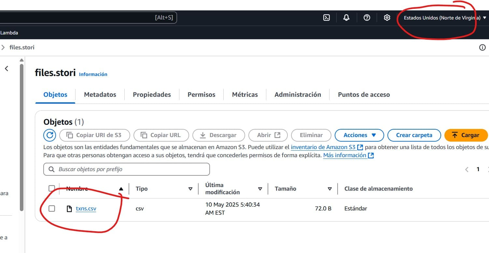
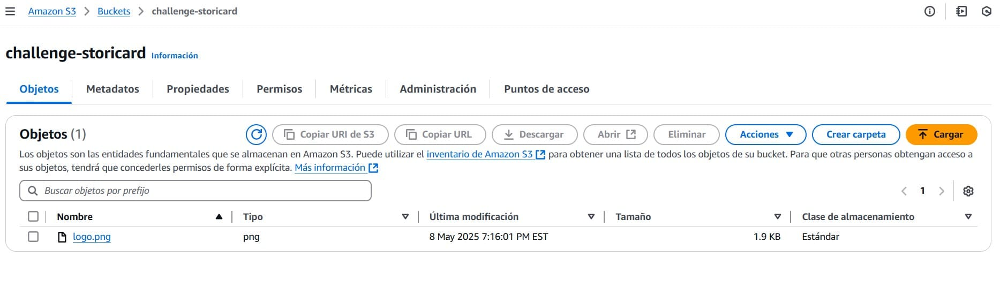

Don't forget to properly configure the buckets — whether it's one or two, as in my case — in the permissions tab

```json
{
    "Version": "2012-10-17",
    "Statement": [
        {
            "Sid": "PublicReadGetObject",
            "Effect": "Allow",
            "Principal": "*",
            "Action": "s3:GetObject",
            "Resource": "arn:aws:s3:::challenge-storicard/*"
        }
    ]
}
```

2. Create the database in RDS using the free tier of MySQL.

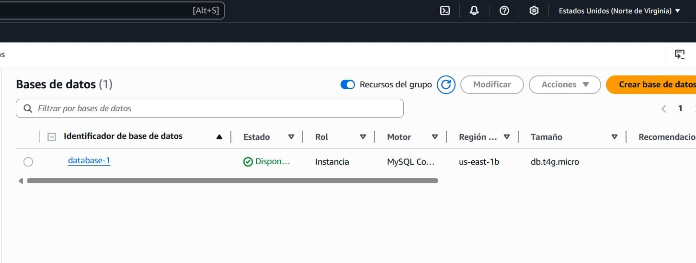

Don't forget to install the tables into the database using the stori.sql file located in the root directory and configure the necessary information in the environment variables of the Lambda function that will be created in the next step.

3. Configure the Lambda function as follows:

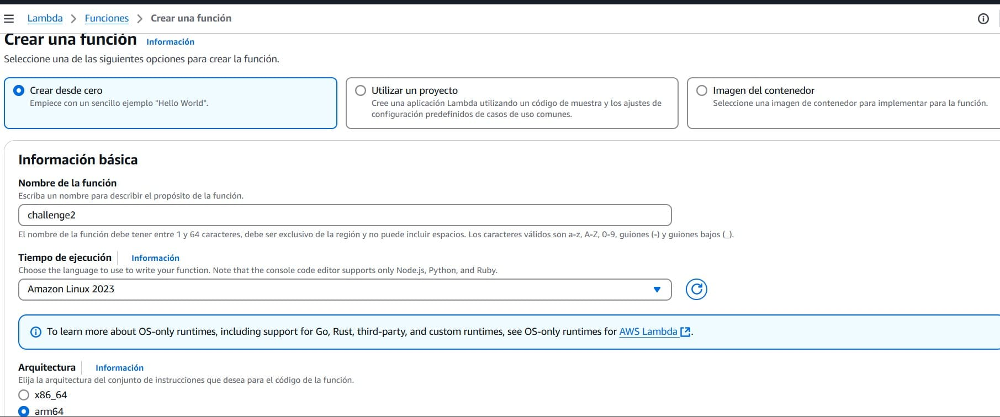

When selecting the security settings, don’t forget to choose the S3 access option.

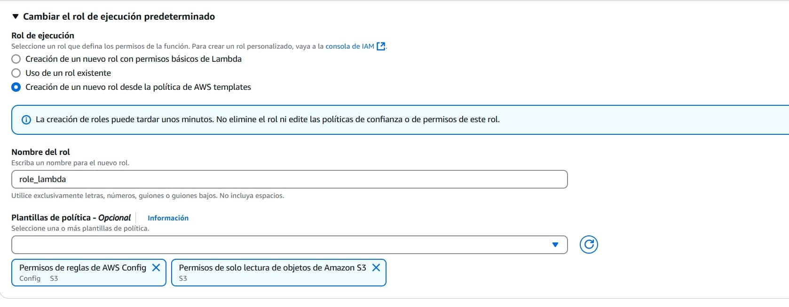

4. Configure the email settings in the environment variables of the created Lambda function


The environment variables are as follows:

```
AWS_S3_BUCKET="files.stori"
AWS_S3_FILE="txns.csv"

DATABASE_USER=""
DATABASE_PASS=""
DATABASE_HOST=""
DATABASE_NAME=""


EMAIL_USER=""
EMAIL_PASSWORD=""
#EMAIL_SMTP_LINK=""
EMAIL_SMTP_LINK=""

EMAIL_THEME_LOGO=""
#EMAIL_THEME=""
EMAIL_THEME=""

EMAIL_FROM=""
EMAIL_TO=""
EMAIL_SUBJECT=""
```

5. To generate the bootstrap file, it is necessary to run the following command where we define the operating system and architecture. This command is only useful in Windows PowerShell, although an equivalent exists for other systems

```go
$env:GOOS = "linux"; $env:GOARCH = "arm64"; go build -o bootstrap ./cmd/lambda
```

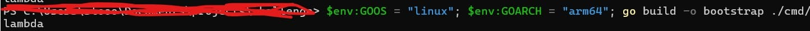

In modern versions, it's no longer the main file followed by main.zip. It was changed to bootstrap, and then it is packaged into a zip file, which would look like this: [boostrap email.html] -> function.zip

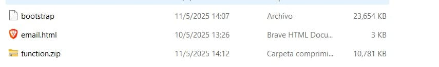

Remember that both bootstrap and the Email must be in the same function.zip file, compressed

To test it, go to your Amazon console, click on the "Test" tab, and then click "Test"

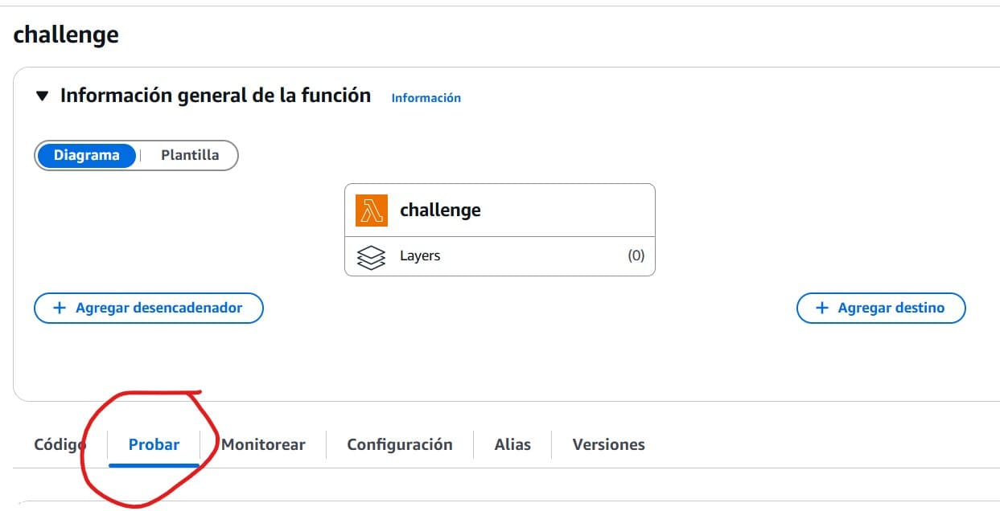
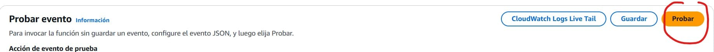

You should see the following:

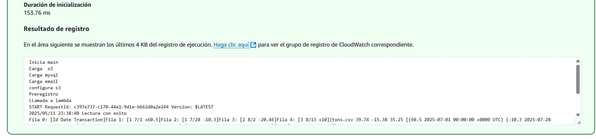

In the end, you should see the email you receive depending on the email you added in the environment variables, and the record should have been added correctly

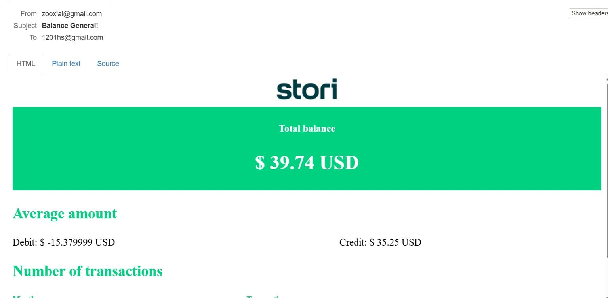
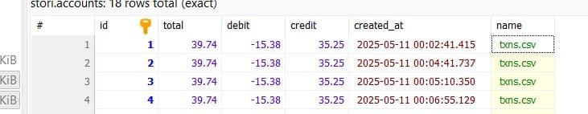

## References

https://medium.com/@dhanushgopinath/sending-html-emails-using-templates-in-golang-9e953ca32f3d
https://gorm.io/docs/create.html#Batch-Insert
https://www.youtube.com/watch?v=kSz3oms4yZM


